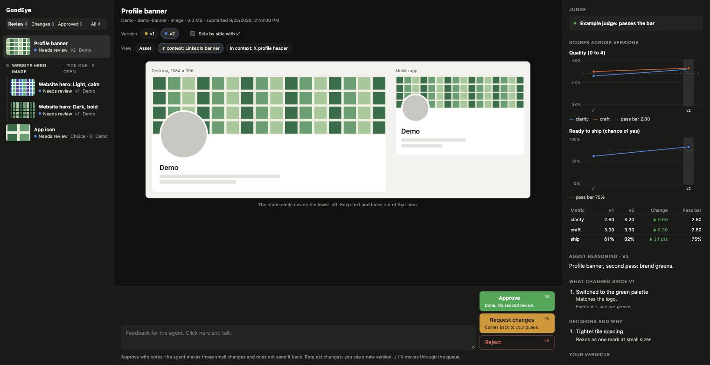
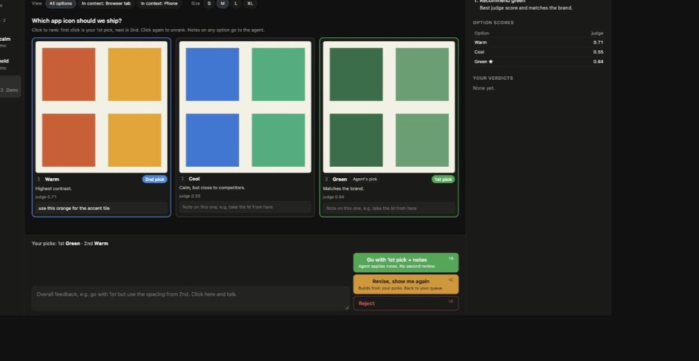
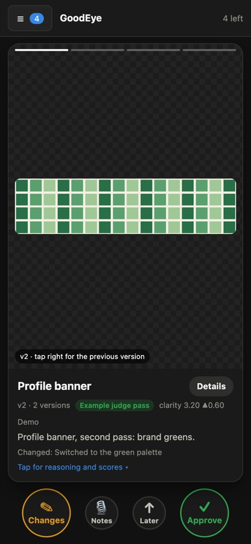
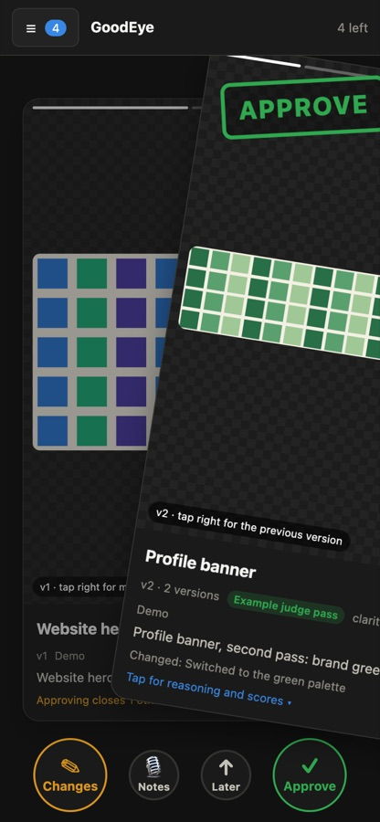

# GoodEye

**A local review board where AI agents submit creative work and you sign off in one click.**

Your coding agent (Claude Code, Codex, or anything with a shell) makes banners, icons, email GIFs, videos and website loops. Instead of opening folders and typing "yes, the third one, but smaller" back into chat, the agent submits each asset to GoodEye. You review it in the browser, inside a mockup of where it will appear, and click **Approve**, **Request changes**, or **Reject**. Talk your notes into the text box. The waiting agent wakes up with your verdict and does the follow-up work.



## Why

Agents can produce dozens of marketing assets an hour. The slow part is you: finding the files, comparing versions, remembering what you asked for, and telling the agent in chat. GoodEye turns that into a queue:

- **One place to review.** Images, GIFs and videos, with a frame-accurate timeline for anything animated.
- **See it where it lives.** Mockups for LinkedIn banner and post, X header and post, Instagram post and story, email (desktop and phone), website hero, browser tab, YouTube thumbnail, and phone.
- **Versions with memory.** Every submission is a frozen version. Compare any two side by side. Judge scores are charted across versions, so you see whether a change helped.
- **The agent must explain itself.** Each submission carries a summary, its decisions with reasons, and from the second version on, what changed in answer to your feedback, quoting your words.
- **Verdicts the agent can act on.** "Approve with notes" means *apply these small fixes, no second review*. "Request changes" means *show me again*. The agent is told exactly which.
- **Pick between options.** A choice shows options side by side. Rank them (1st, 2nd), note any one ("take the orange from this one"), and send.
- **Spec checks.** Each file is checked against its placements (LinkedIn banner 1584×396, X header 1500×500, YouTube thumbnail 1280×720, story 9:16, email width and GIF size, favicon shape, hero file size). The agent sees the warnings when it submits; you see them on the card.
- **Notes that point at a moment.** "Note at 0:03.20" on the timeline adds the time to your note. Hold **C** (or long-press on a phone) to flash the previous version. Your most-used notes come back as one-tap chips.
- **Know the agent is listening.** The board shows whether an agent is waiting for verdicts. Changes that never came back are flagged, and the agent gets one reminder on its next `goodeye wait`.
- **One winner per placement.** Put competing candidates in a *slot*. Approving one closes the others, after you confirm.



## Install

Requires Python 3.9 or newer. No other dependencies. `ffprobe` (from ffmpeg) is optional and adds video frame counts.

```bash
git clone https://github.com/coreyonbreeze/goodeye.git
cd goodeye
./install.sh              # `goodeye` in ~/.local/bin, the skill in ~/.claude/skills
goodeye demo && goodeye open
```

`./install.sh --project path/to/repo` installs the skill for one project only. The installer uses symlinks, so `git pull` updates both the command and the skill. A running board restarts itself when the code changes.

## Use it with your agent

**Claude Code:** the installer adds the `goodeye` skill. Ask your agent to make something ("make three LinkedIn banner options for the launch") and it submits to the board, then waits in the background. You can also tell it: *"Send everything that needs my sign-off to GoodEye."*

**Other agents (Codex, Cursor, Aider, ...):** point the agent at the skill file, for example by adding this to `AGENTS.md`:

```
For any creative asset that needs my approval, follow skills/goodeye/SKILL.md from the GoodEye repo.
```

The loop, whichever agent you use:

```
agent: goodeye submit banner.png --id banner --reasoning r.json --scores s.json --context linkedin-banner
agent: goodeye wait            (in the background)
you:   open http://localhost:4400, look, click Approve with a note
agent: wakes with "APPROVED WITH NOTES ... Do NOT resubmit", applies the note, moves on
```

## Commands

| Command | What it does |
|---|---|
| `goodeye submit FILE --id ID --reasoning R.json` | Submit a new version of an item. Options: `--title`, `--project`, `--version`, `--context a,b`, `--scores S.json`, `--slot KEY --slot-label NAME` |
| `goodeye submit --options O.json --id ID --reasoning R.json` | Submit a choice between 2 to 9 options |
| `goodeye wait [--project P] [--timeout S]` | Block until a verdict arrives, print it with a `next:` instruction, exit |
| `goodeye status [--project P]` | List items and their latest state |
| `goodeye slot KEY ID... [--label NAME]` | Put existing items in one slot |
| `goodeye serve [--port N]` / `goodeye open` | Run the board / open it in the browser (submit starts it automatically) |
| `goodeye demo` | Load four sample items |
| `goodeye phone [--off] [--new-token]` | Open the board to your phone (QR code, token-protected) |
| `goodeye notify --ntfy URL` / `--off` / `--test` | Push a phone notification when new work arrives (opt-in) |
| `goodeye export DIR [--project P]` | Copy approved final files (pick 1 for choices) plus a `manifest.json` |

Environment: `GOODEYE_HOME` (store, default `~/.goodeye`), `GOODEYE_PORT` (default `4400`).

## File formats

**Reasoning** (required, see [examples/reasoning.json](examples/reasoning.json)):

```json
{
  "summary": "What this is and where it will be used.",
  "decisions": [{"choice": "What the agent decided", "why": "The evidence"}],
  "changes": [{"change": "What changed", "why": "Why", "feedback": "The reviewer's words it answers"}],
  "open_questions": ["Questions only the reviewer can decide"]
}
```

`changes` is required from the second version on.

**Scores** (optional, from any judge: an LLM judge, a linter, a measurement; see [examples/scores.json](examples/scores.json)):

```json
{
  "scores": {"clarity": {"value": 3.2, "max": 4, "bar": 2.8, "group": "Quality (0 to 4)"}},
  "judge": {"name": "My judge", "pass": true, "notes": ["Weakest area: hook"]}
}
```

Metrics with the same `group` share one chart. `bar` draws the pass line and flags scores below it. A flat `{"clarity": 3.2}` also works.

**Options** for a choice: see [examples/options.json](examples/options.json).

## Verdicts

| You click | The agent is told |
|---|---|
| Approve | Approved as is. Record it and continue. |
| Approve, with notes | Apply the notes. **Do not resubmit.** |
| Request changes | Make a new version that answers every point and resubmit. |
| Reject | Stop work on this item. |
| Go with 1st pick (choice) | Build pick 1, apply any notes (a note on another option means take that part from it). Pick 2 is the fallback. |
| Revise, show me again (choice) | Build from your picks, or offer new options if you picked none, and resubmit. |
| Approve, in a slot | The other candidates in the slot are closed as *not chosen*. |
| Reopen (on a rejected or not-chosen item) | It is back in review; wait for the next verdict. |

## On your phone

```bash
goodeye phone        # prints a QR code; scan it with your phone's camera
```

Phone mode lets devices on your Wi-Fi (or your Tailscale network) open the board. The QR link carries a random secret that signs the phone in once, with an `HttpOnly`, `SameSite=Strict` cookie; without it every request gets 403. `goodeye phone --off` returns to this-computer-only, and `--new-token` signs every phone out. The desktop board's **Phone** button shows the same QR code.

On a phone the board is a card deck:

<p> </p>


- **Swipe right** approves (a dictated note rides along as "approve with notes"). **Swipe left** asks what should change, with *Reject* as a secondary option. **Swipe up** puts the card at the back.
- **Tap the image** to page through the asset, the previous version, and each placement mockup. **Tap the text** to expand the reasoning and every score with its change since the last version.
- Every verdict waits 4 seconds with **Undo** (8 seconds when the judge scored it below the bar). Approving in a slot asks first and lists what will close. Closed items can be **reopened**.
- Choices: tap options to rank, swipe right to go with your 1st pick.
- Haptics mark the commit point of a swipe and each verdict (Android vibration; iPhone on iOS 18+ uses the system switch haptic).
- Add it to your home screen for a full-screen app. **Details** (or the ☰ queue) opens the full layout.

## Settings

**⚙ Settings** (top bar on a phone, queue header on desktop) has two parts:

- **All devices** (saved in `~/.goodeye/config.json`): phone notifications on or off, the ntfy topic, a test button, and how many hours before a change request is flagged as stale. Phone mode is shown but only switched on the computer (`goodeye phone` / `--off`), so a phone cannot lock itself out.
- **This device** (saved in the browser): vibration, undo window (3 to 8 seconds), swipe distance, whether the phone opens to cards or the list, theme (system, dark, light), jumping to the next item after a verdict, quick-reply chips, and replaying the swipe tutorial.

## Keyboard

`J` / `K` next and previous item. Hold `C` to flash the previous version. `⌥A` approve, `⌥C` request changes, `⌥R` reject (these work while you type). `1` to `9` rank options in a choice. `Space` play or pause, `,` / `.` or the arrow keys step one frame.

## Privacy and security

Everything stays on your machine: by default the board listens on `127.0.0.1` only (phone mode opens it to your network behind a secret token), makes no outside network calls, and has no telemetry. It refuses cross-site writes and DNS-rebinding reads, cannot be framed, and serves uploaded files in a sandbox. Details in [SECURITY.md](SECURITY.md). Your store (`~/.goodeye`) holds copies of the submitted files and your verdicts; nothing is committed to this repository.

## Roadmap

GoodEye starts with creative sign-off. The direction is a go-to-market workbench for teams that refresh their marketing approach every two weeks, not every quarter:

- **Signals next to the creative.** Channel analytics, past performance of similar assets, and audience data shown beside each decision, so a verdict is informed by numbers, not taste alone.
- **Judges as plug-ins.** Bring your own LLM judge or scoring service; GoodEye already charts any judge's scores across versions.
- **Campaign rounds.** Group a two-week batch of assets into one round with a brief, then compare what shipped against what performed.
- **More placements.** Ads, app store screenshots, landing page sections, slides.

Ideas and pull requests are welcome. See [CONTRIBUTING.md](CONTRIBUTING.md).

## License

MIT. See [LICENSE](LICENSE).
